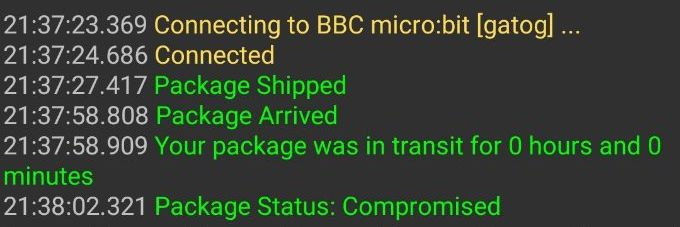

# IoT Challenge III
Implement bluetooth communication between a BBC Micro:bit device and a phone

**Author**: Mariyam Yasmeen (S1800367) & Ismath Ibrahim (S1900094)\
**Batch**: BSc (Hons) Computer Science Jan 2019\
**Project Name**: Package Tracker\
**Created Date**: August 2020\
**Description**: Demostrating the bluetooth capabilities of the Microbit\
by making a package tracker that logs the time in transit and if\
the package was dropped during shipment

# Introduction  
Since online shopping is a useful method of getting your items (and currently\
at an all time high due to the pandemic), devices that can track the shipment\
and its state through the shipping process can help a lot of customers. This is\
especially applicable in situations where a customer had paid for express\
shipping or had shipped time sensitive items and are eligible to claim money\
back if certain terms are not met. This device can also be used when shipping\
fragile items, since any drops during shipment is also logged by the device\
and sent as a report to the receiver of the package.

## Before we begin, lets get our gear ready
* One Microbit & battery pack (external power source makes it easier to test drops)
* One smartphone that runs Android OS
* Type Micro-B USB cable to transfer the hex

# The Setup

### Step One: Download the App
Since the system depends on being able to send messages via bluetooth to a\
terminal, the phone must have bluetooth switched on and the required app installed.\
You can downloaded the app from this [link](https://play.google.com/store/apps/details?id=de.kai_morich.serial_bluetooth_terminal)
### Step Two: Pairing the microbit
* Flash the Tracker.hex onto your microbit to help you pair your device.
* Open the app on your phone & head to devices, hit scan if you don't see the Microbit
* If you're still unable to see your device press A + B buttons on your Microbit \
and then press and release the reset button to put your Microbit in pairing mode
* Once you find the Microbit, click on it to connect (if you still get an error, go\
back to devices and long press the Microbit and click edit. Select custom settings\
and press on UUID, read and write to automatically pick up the suggested values)
* You should then be able to click the plug icon on the terminal and connect

How to configure the manual settings if predefine settings don’t work  

You can press Service, read and write UUID fields to get the values auto-generated

## How to use the tracker

### Flashing the hex file
You can either build the files on your own, or transfer the Tracker.hex file\
in this repo. If you wish to build your own hex, you may use the following methods

### Building from source (Online)

Mbed has an [online compiler](https://ide.mbed.com/compiler/) which makes it easy for you to build your project.

1. First you need to get an [mbed](ide.mbed.com) account.
2. Once you're logged in, open the compiler and create a new empty program.
3. Click import from the toolbar and search for "Microbit".
4. Import the lancaster DAL library.
5. Create your project's main.cpp file.
6. Take the code in main.cpp that's located in this repo and copy it into your main.
7. You can now hit the Compile button which will auto download a *.hex file.
8. Plug your Microbit and flash the hex file into it.
9. Start using the tracker!  

### Building from source (Offline)
1. Install the Yotta build system with the instructions found [here](http://docs.yottabuild.org/#installing).
2. Hit clone on this repo so you get a copy
3. Open the folder in the terminal and run the command `yotta build` in the folder.
4. Flash the {name}-combined.hex file onto your Microbit.
5. Start using the tracker!
You can find more information on yotta builds at this [link](http://docs.yottabuild.org/tutorial/building.html).

# Micro:Bit Handling
When you start using the Microbit, it will flash 'hello' and an arrow will point\
towards the next button you need to press. The arrow will point first at A, then B.\
Button A: Press to start the tracking process. (This will be used by the shipper).\
Button B: Press to end the tracking process. (This will be used by the customer).

# Micro:Bit Package Tracker Usage
The Microbit can be put inside the shipped package and taken out once it is\
received. This way, the customer has a digital log of the time the package was\
in transit and also knows if the package was mishandled and dropped at any point.\
The shipper would press A to start the tracking process which will be confirmed\
by the Microbit displaying "tracking" and the app displaying "Package Shipped".\
Once the product arrives, the customer will press B to stop the tracking and confirm\
that they have received the package. The app will display "Package Arrived" as a\
confirmation and also print a log of the time it took between the shipping and\
arrival and also a status of the package. If it was never dropped the status will\
be "safe". If the package was dropped at any point the status will say "compromised".\
Additionally, the Microbit display will also show the time as xxh xxm and then\
scroll "safe" or "compromised" to show the status. The log can then be exported\
from the app if a complaint needs to be filed or in order to leave reviews with\
proof for fast and safe deliveries.

## Screenshots
Tracked package that was not dropped  

Tracked package that was dropped  

## Warnings
Make sure that the bluetooth on your device is switched on and that you're using\
an Android device. For the time being, there is no app that functions similiarly\
for iOS devices that can detect and connect to Microbits.

# FAQ
If you are unable to use the tracker, try one of the following fixes:

### How do we flash the hex onto the microbit?
Plug your microbit into your computer so that it appears as a USB device.\
Download the tracker.hex file in this repo and drag and drop onto the device.

### Why won't my Microbit show on the computer?
Check if the USB cable trasnfers data since some will only provide power. If that\
doesn't work, try to connect it to a different computer.

### Why won't my Microbit switch on?
If your Microbit is powered on using a cable try to see if it's properly connected.\
If it is then try a different cable. If you are connected to a battery pack try\
replacing the batteries.

### Why won't the app connect to my microbit?
Occasionally, Microbit's have a malfunctioning UART that is not able to send the\
proper signals and therefore, even if you follow the steps, you may not be able to\
connect. Try using a different Microbit and if the problem persists remove the\
Microbit from the app and retry.

###If you have any enquiries, find a bug or just want to say hello mail us at\
###mariyam2.yasmeen@live.uwe.ac.uk or ismath2.ibrahim@live.uwe.ac.uk

# Have Fun!

